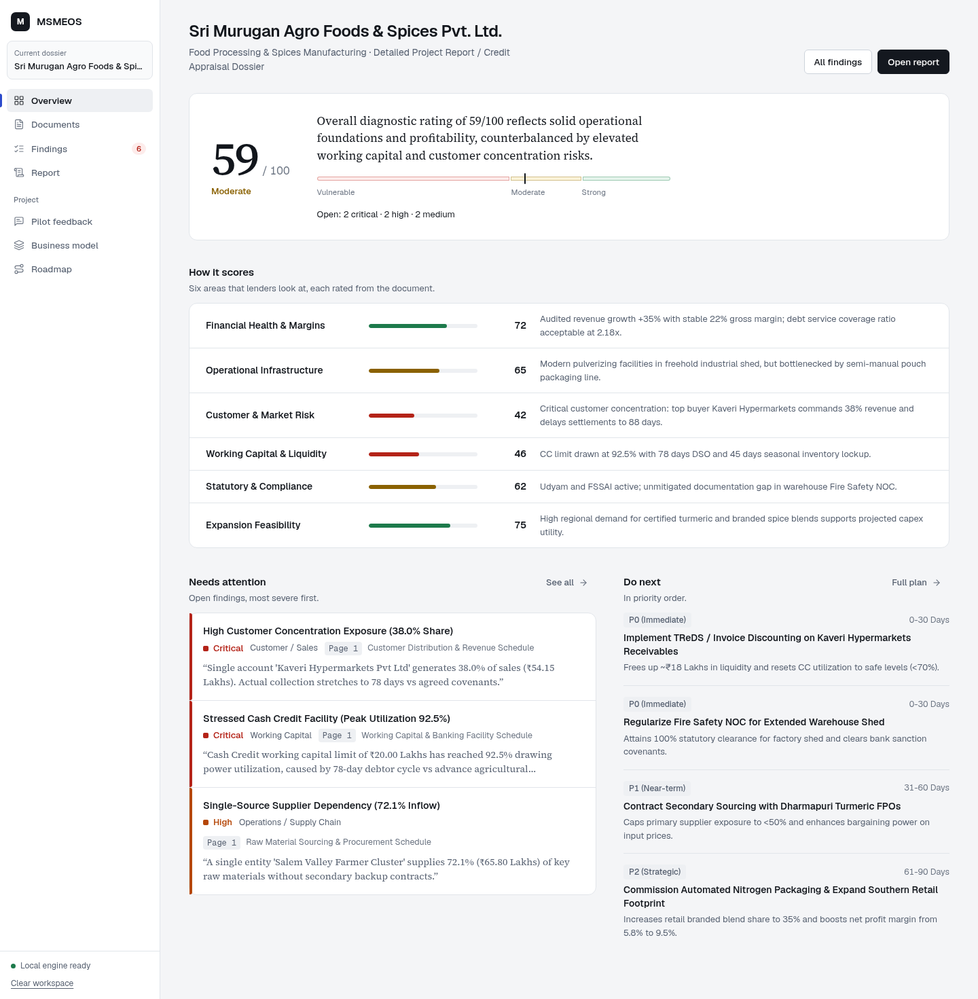
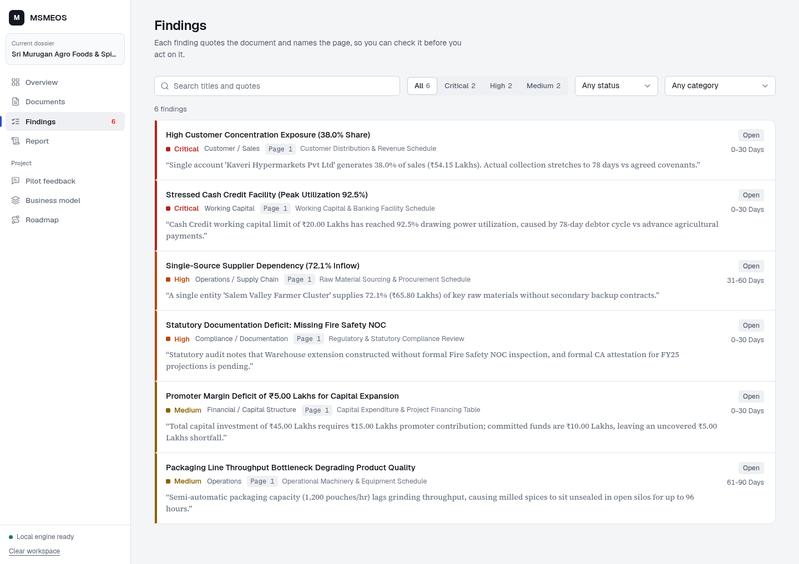
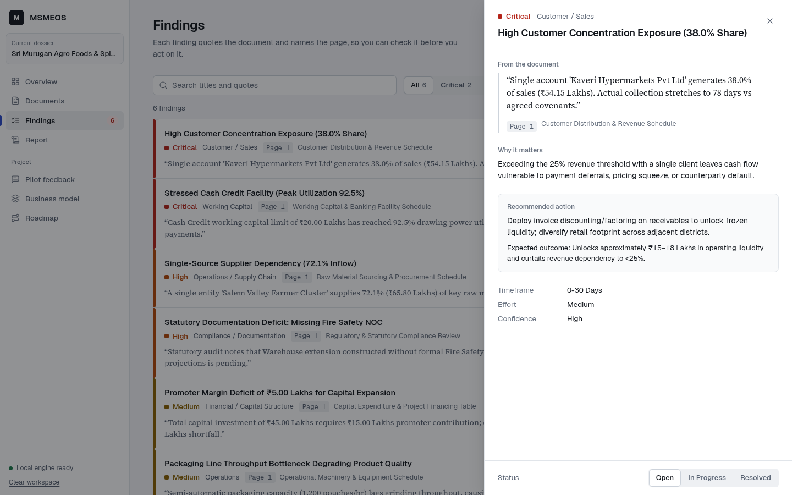
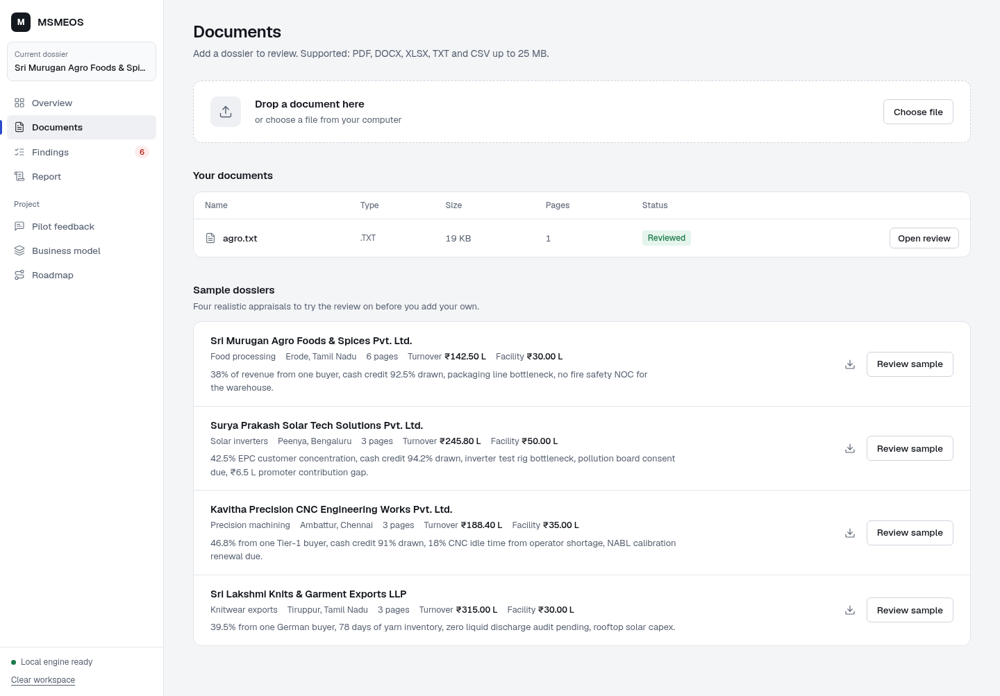
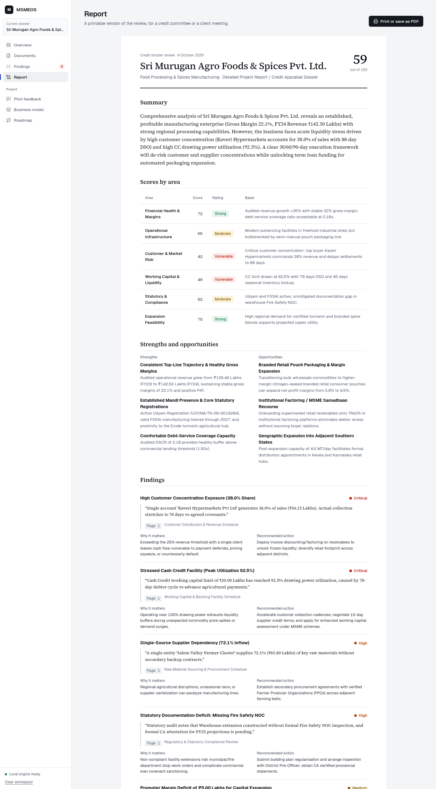
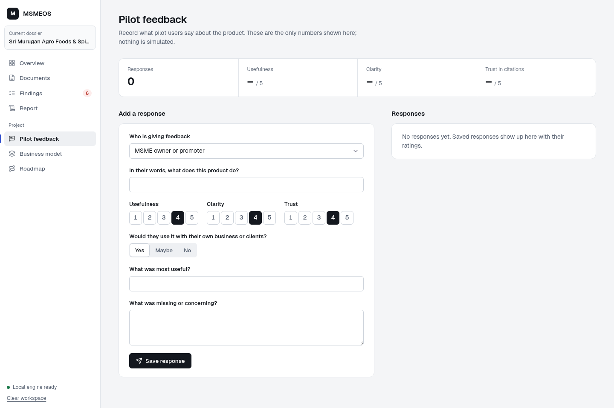
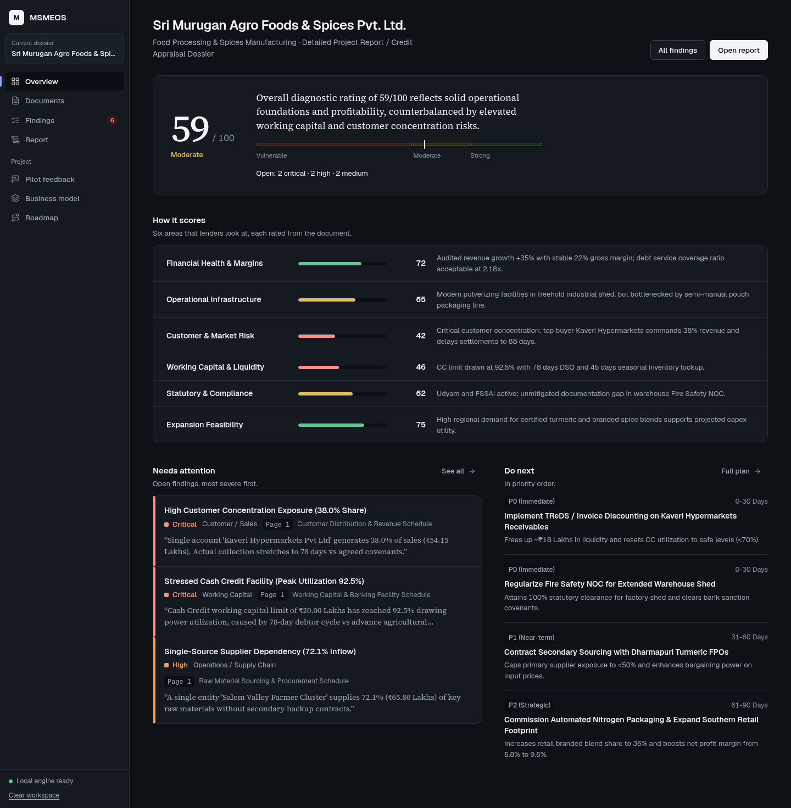
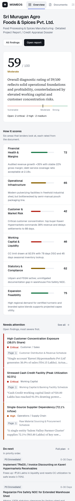

# MSMEOS2 — Intelligent Document Decision Platform

Evidence-backed document intelligence, financial diagnostics, and prioritized decision support for Micro, Small and Medium Enterprises (MSMEs).

---

## 1. Problem & Value Proposition

Indian MSME owners routinely produce detailed project profiles, bank loan applications, tax filings, and operational schedules. However, critical risk signals—such as customer concentration, delayed debtor cycles, stressed working capital limits, and statutory gaps—remain buried inside complex documentation.

**MSMEOS2 transforms unstructured business documents into clear, prioritized business intelligence:**
> Document Intake → Normalized Fact Extraction → Diagnostic Scoring → Evidence Citations → Actionable 30/60/90-Day Execution Plan.

---

## 2. Key Capabilities

- **Multi-Format Extraction:** PyMuPDF, python-docx, openpyxl, CSV, and plain text parsers with automatic file size (25 MB max) and type validation.
- **Evidence-First Diagnostic Engine:** Every significant finding includes an authentic page/schedule quotation, reference citation, and risk severity ranking.
- **Deterministic & LLM Fallback:** Comprehensive rule-based analysis operates 100% locally with zero external API dependencies, with optional LLM augmentation when configured.
- **Executive Board Report:** Print-ready, executive diagnostic dossier with 30/60/90-day action framework and statutory legal disclaimer.
- **Real-Time Validation Hub:** In-app feedback collection for MSME owners, accountants, and credit advisors with live statistical metrics (no fabricated data).
- **Commercialization & Roadmap:** Built-in Lean Canvas, 4-tier commercial pricing structure, and multi-phase product roadmap.

---

## Screenshots

**Overview.** The verdict first: a score, one sentence on why, and where it falls on the scale. Below it, the six areas that make up the score, the open findings that need attention, and what to do next.



**Findings.** Every finding quotes the document and names the page it came from. Filter by severity, status or category, or search the quotes.



**Finding detail.** The quote and page reference, why it matters, the recommended action, and a status you can update as you work through it.



**Documents.** Drop in a PDF, DOCX, XLSX, TXT or CSV, or try one of four sample dossiers.



**Report.** A printable version of the review with the 30/60/90-day plan, for a credit committee or a client meeting.



**Pilot feedback.** Record real feedback from pilot users. Only recorded responses are counted.



**Dark mode and small screens.** The interface follows the system light or dark setting and works down to phone width.

 

---

## 3. Quick Start

### Prerequisites
- Python 3.11+ (tested on Python 3.13 / 3.14 on Windows 11)
- Node.js 18+ (tested on Node v24.11.0)

### Running the Application

**One command** (creates the virtual environment, installs dependencies, builds the frontend and opens the app):

- Windows: double-click `start.bat`, or run it from a terminal.
- Linux / macOS: `./start.sh`

Then open [http://127.0.0.1:8000](http://127.0.0.1:8000). Set the `PORT` environment variable to use another port.

<details>
<summary>Manual steps</summary>

```powershell
python -m venv venv
venv\Scripts\activate
pip install -r requirements.txt
cd frontend && npm install && npm run build && cd ..
python app.py
```

For frontend development, run `npm run dev` in `frontend/` (port 5173, proxies `/api` to port 8000).
</details>

---

## 4. One-Click Demo Instructions

1. Open [http://127.0.0.1:8000](http://127.0.0.1:8000).
2. Open **Documents** and click **Review sample** next to a sample dossier.
3. The platform ingests the bundled 6-page project report for *Sri Murugan Agro Foods & Spices Pvt. Ltd.* (`sample-data/demo-document.pdf`).
4. Inspect the 59/100 Readiness Score dial, 6 evidence-backed findings, and the 30/60/90-day plan.
5. Filter findings in **Findings**, open one to see its citation, and update its status.
6. Print the dossier from the **Report** tab.
7. Record real evaluation feedback in **Pilot feedback**.

---

## 5. Automated Test Suite

Run the full automated test suite (covering endpoints, validations, extraction, scoring, status patching, and feedback):

```powershell
.\venv\Scripts\python.exe -m unittest tests.test_api
```

See [`TESTING.md`](./TESTING.md) for full test matrix and verification logs.

---

## 6. Architecture & Technology Stack

- **Backend:** FastAPI, Python 3.13, Pydantic, SQLite3, PyMuPDF, ReportLab.
- **Frontend:** React 18, Vite, Lucide Icons, Plus Jakarta Sans, Custom B2B Slate Design System.
- **Persistence:** Local SQLite database (`msmeos2.db`).
